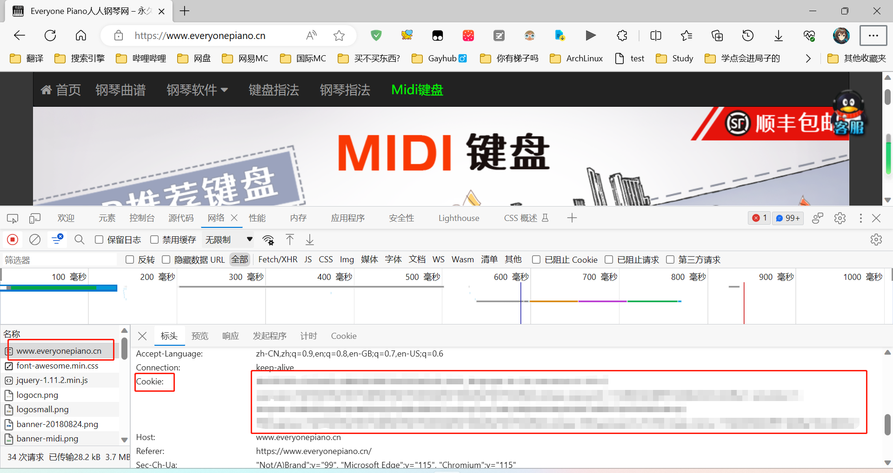
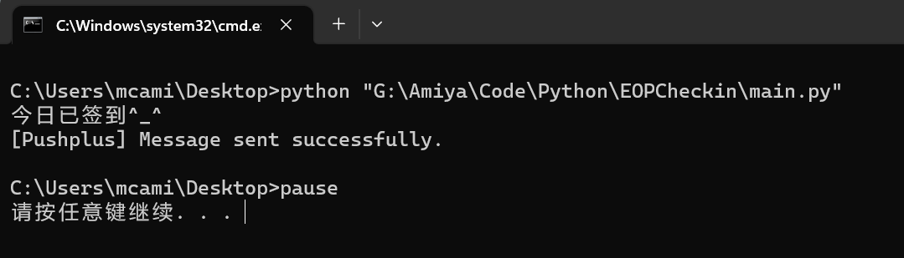
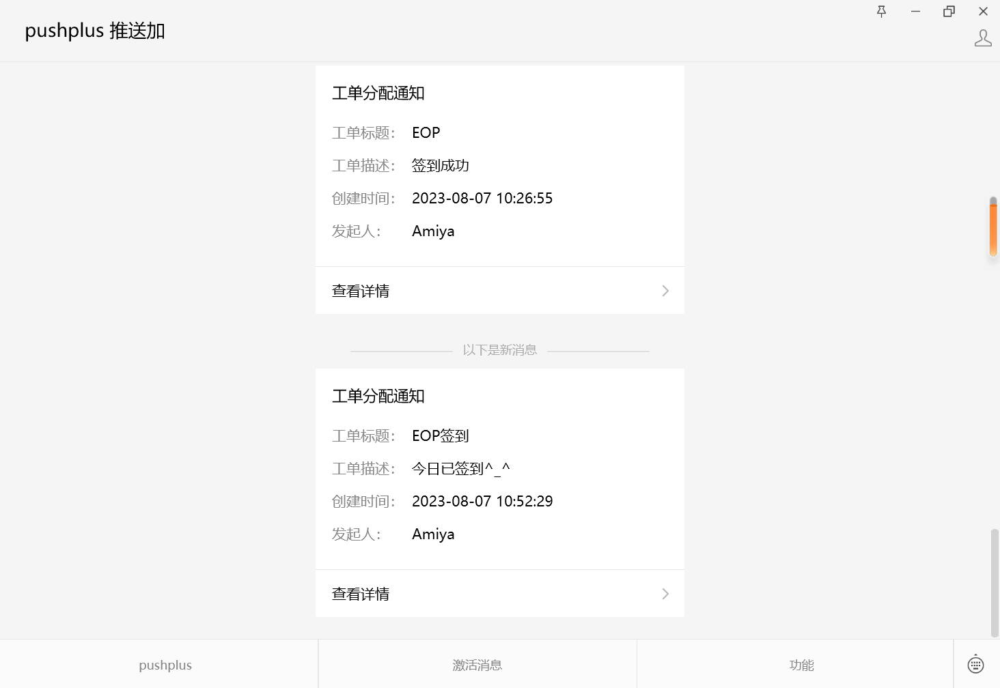

<h2 align="center" style="font-weight: 600">EOP官网自动签到</h2>

## ✨ 介绍

- ✅ 使用 Python 开发
- ✔️ EOP 官网自动签到（解放双手）

## 📦️ 可执行文件

- 🛠 后续将会支持，那就不需要 python 环境了

## ⚙️ 配置用户信息

运行 main.py 之前，请先到 `app_config.py` 中配置 `pushplus_key` 和 `EOP_cookie`

- `pushplus_key` 是 pushplus 推送平台的 key 可以到[官网](https://www.pushplus.plus/ "点击跳转pushplus官网")去免费注册
- `EOP_cookie` 则是你 EOP 账号的信息 可以到[官网](https://www.everyonepiano.cn/ "点击跳转EOP官网")通过万能的 `F12` 获取
  把你的 `cookie`全部复制粘贴进 `app_config.py`的 `EOP_cookie`即可
  

## 💻 项目，启动！

运行本项目

```shell
# 安装依赖
pip install requests

# 运行
python main.py
```

## 📜 开源许可

本项目仅供个人学习研究使用，禁止用于商业及非法用途。

基于 [GNU GPL v3](https://www.gnu.org/licenses/gpl-3.0.en.html#license-text) 许可进行开源。

## 🖼️ 截图




